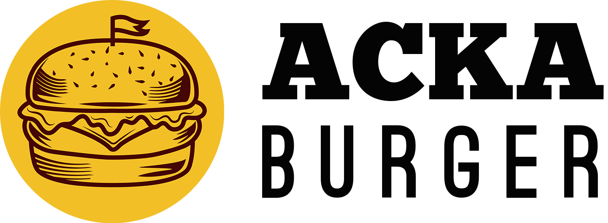
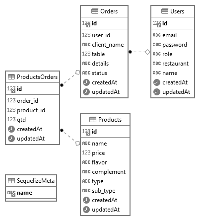

<h1 align="center">
  
</h1>

# Acka Burger API

API rest para o restaurante Acka Burger.
_A documentação da API pode ser acessada atraves do Link: [Acka Burger API](https://ackaburger-api.herokuapp.com/api-doc/)_

## Índice

- [1. Resumo do Projeto](#1-resumo)
- [2. Endpoints disponíveis](#2-endpoints)
- [3. Futuras Implementações](#3-implementacoesfuturas)

---

## 1. Resumo do Projeto

A interface da aplicação [Acka Burger](https://acka-burger.vercel.app/), disponível [nesse respositório](https://github.com/anaclara-gf/SAP005-burger-queen), foi desenvolvida anteriormente para gerenciar os pedidos do restaurante. O objetivo desse projeto foi desenvolver uma _API rest_ integrada a um banco de dados relacional para manejar os dados do negócio.

Para orientar a modelagem do banco de dados, pensando nas necessidade da aplicação, foi realizado um [_Diagrama Entidade Relacionamento_](https://medium.com/@mauriciogeneroso/banco-de-dados-diagrama-entidade-x-relacionamento-der-5ce497d930db) demonstrado abaixo:

## 2. Endpoints disponíveis

### 2.1 `/auth`

* [ ] `POST /auth`

### 2.2 `/users`

* [ ] `GET /users`
* [ ] `GET /users/:uid`
* [ ] `POST /users`
* [ ] `PUT /users/:uid`
* [ ] `DELETE /users/:uid`

### 2.3 `/products`

* [ ] `GET /products`
* [ ] `GET /products/:productid`
* [ ] `POST /products`
* [ ] `PUT /products/:productid`
* [ ] `DELETE /products/:productid`

### 2.4 `/orders`

* [ ] `GET /orders`
* [ ] `GET /orders/:orderid`
* [ ] `POST /orders`
* [ ] `PUT /orders/:orderid`
* [ ] `DELETE /orders/:orderid`

## 3. Futuras Implementações

A segunda versão da API será atualizada contendo:

- Testes unitários para cada função
- Testes "end to end" ou e2e (de uma ponta a outra)
- Endpoint `/clients` para cadastrar os clientes do restaurante para implementação de um programa de fidelidade e, também, para tornar possível um sistema delivery

---

Esse projeto faz parte do currículo do <a href="https://www.laboratoria.la/br">Bootcamp da Laboratória Brasil</a>

:star: Desenvolvido por: <a href="https://github.com/anaclara-gf">Ana Clara Garcia Farah</a> :star:

